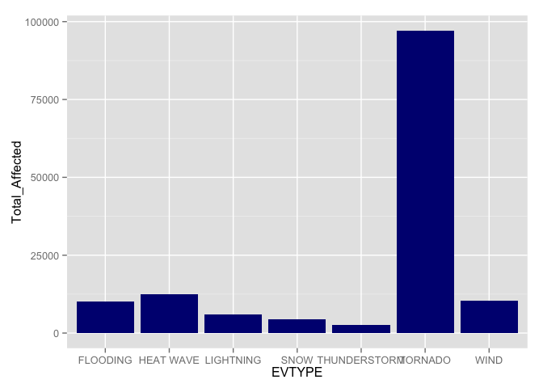
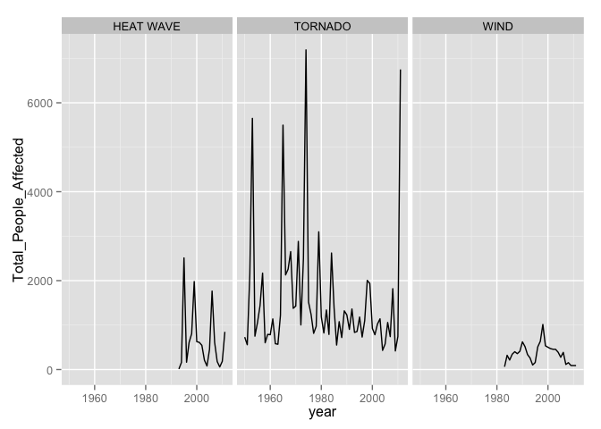
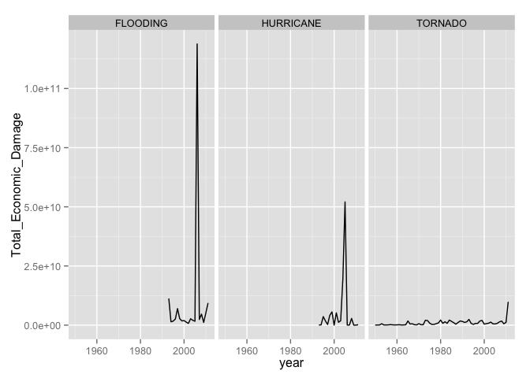

# Analysis of U.S. Severe Weather Data and its Impact on Population and Property

### Synopsis
Storms and other severe weather events can cause both public health and economic problems for communities and municipalities. Many severe events can result in fatalities, injuries, and property damage, and preventing such outcomes to the extent possible is a key concern.

The data provided to us is : [Storm Data] (https://d396qusza40orc.cloudfront.net/repdata%2Fdata%2FStormData.csv.bz2)

Below Analysis is conducted to identify the events which are most damaging to Population and Property.

To summarise :

 + It is identified that the 3 most damaging events to population are : `TORNADO`, `Heat Wave`, `Wind`
 + The 3 most damaging events economically (Property and Crop) are : `Flooding`, `HUrricane`, `Tornado`

### Data Analysis

####1. Load Libraries

```r
library(knitr)
library(tidyr)
library(dplyr)
library(lubridate)
library(ggplot2)
```

####2. Unzip and Load the datafile.


```r
 unzip("stormData.csv.bz2", "stormData.csv")
 data<-read.csv("stormData.csv", header=TRUE, stringsAsFactors=FALSE)
 data<-tbl_df(data)
```


####3.Cleaning Data
Taking a look at the current range of EVTYPE, we see that there are quite some similar categories which can be renamed and regrouped for accurancy.
Below we try to identify and rename most of those cases.


```r
data[grep("THUNDER",data$EVTYPE),"EVTYPE"]<-"THUNDERSTORM"
data[grep("TORNADO",data$EVTYPE, ignore.case=TRUE),"EVTYPE"]<-"TORNADO"
data[grep("WIND",data$EVTYPE, ignore.case=TRUE), "EVTYPE"]<-"WIND"

data[grep("FUNNEL",data$EVTYPE, ignore.case=TRUE),"EVTYPE"]<-"TORNADO"
data[grep("HURRICANE",data$EVTYPE, ignore.case=TRUE),"EVTYPE"]<-"HURRICANE"
data[grep("SNOW",data$EVTYPE, ignore.case=TRUE),"EVTYPE"]<-"SNOW"
data[grep("BLIZZ",data$EVTYPE, ignore.case=TRUE),"EVTYPE"]<-"SNOW"
data[grep("ICE",data$EVTYPE, ignore.case=TRUE),"EVTYPE"]<-"ICE"
data[grep("SLEET",data$EVTYPE, ignore.case=TRUE),"EVTYPE"]<-"ICE"
data[grep("ICY",data$EVTYPE, ignore.case=TRUE),"EVTYPE"]<-"ICE"
data[grep("FREEZ",data$EVTYPE, ignore.case=TRUE),"EVTYPE"]<-"ICE"
data[grep("FLOOD",data$EVTYPE, ignore.case=TRUE),"EVTYPE"]<-"FLOODING"
data[grep("LIGHTN",data$EVTYPE, ignore.case=TRUE),"EVTYPE"]<-"LIGHTNING"
data[grep("HEAT|HOT|WARM",data$EVTYPE, ignore.case=TRUE),"EVTYPE"]<-"HEAT WAVE"
data[grep("COLD|LOW",data$EVTYPE, ignore.case=TRUE),"EVTYPE"]<-"COLD WAVE"
data[grep("WINTER",data$EVTYPE, ignore.case=TRUE),"EVTYPE"]<-"SNOW"
data[grep("WATERSPOUT",data$EVTYPE, ignore.case=TRUE),"EVTYPE"]<-"TORNADO"
data[grep("(TROPICAL|COASTAL)(.|)STORM",data$EVTYPE, ignore.case=TRUE),"EVTYPE"]<-"HURRICANE"
data[grep("RAIN",data$EVTYPE, ignore.case=TRUE),"EVTYPE"]<-"RAINFALL"
data[grep("HAIL",data$EVTYPE, ignore.case=TRUE),"EVTYPE"]<-"HAIL"
data[grep("FIRE",data$EVTYPE, ignore.case=TRUE),"EVTYPE"]<-"FOREST FIRE"
```


####4. Impact on Population (Injuries and Fatalities)

Here we'll analyse which events have caused the most damage to Population causing Injuries and Fatalities. 

 - Begin by filtering out where FATALITIES and INJURIES are 0.
 - Then group by EVTYPE to summarise Total_Affected.
 - Display the top 10 results in descending order of Total_Affected.
 - Also displayed is Total numer of ocuurences of each Event.
 - We'll make a quick plot of top 7 EVTYPES and its impact on population.


```r
PopImpactDF<- select(data, BGN_DATE,STATE, contains("DMG"), FATALITIES, INJURIES, EVTYPE)
PopImpactDF <- PopImpactDF %>% filter(!(FATALITIES<1 & INJURIES <1))
PopImpactDF$BGN_DATE<-mdy_hms(PopImpactDF$BGN_DATE)


PopImpactSummaryDF<-group_by(PopImpactDF, EVTYPE) %>% summarise(Total_Fatalities=sum(FATALITIES), Total_Injuries=sum(INJURIES), Total_Events=n()) %>% mutate(Total_Affected=Total_Injuries+Total_Fatalities
) %>% arrange(desc(Total_Affected))


head(select(PopImpactSummaryDF, EVTYPE, Total_Affected, Total_Events),10)
```

```
## Source: local data frame [10 x 3]
## 
##          EVTYPE Total_Affected Total_Events
## 1       TORNADO          97103         7942
## 2     HEAT WAVE          12421          946
## 3          WIND          10275         4094
## 4      FLOODING          10127         1410
## 5     LIGHTNING           6048         3307
## 6          SNOW           4344          613
## 7  THUNDERSTORM           2692         1067
## 8           ICE           2338          139
## 9     HURRICANE           1916          116
## 10  FOREST FIRE           1698          333
```

```r
ggplot(PopImpactSummaryDF[1:7,])+geom_bar(aes(EVTYPE, Total_Affected), stat="identity", fill="navy")
```

 


#### 5. Looking at the Economic Impact
  + We'll begin with identifying the columns for Property and Crop Damage
  + Exclude data where both (Property and Crop) damage value is 0.


```r
econImpactDF<- select(data, BGN_DATE, STATE, contains("DMG"), FATALITIES, INJURIES, EVTYPE)
econImpactDF$BGN_DATE<-mdy_hms(econImpactDF$BGN_DATE)
econImpactDF <- econImpactDF %>% filter(!(PROPDMG<1 & CROPDMG <1)) %>% select(-FATALITIES, -INJURIES)
```

  + Now lets see the values in `PROPDMGEXP` and `CROPDMGEXP`
  + It appears that they are exponents marked in B,M,K. So we'll need to convert them to numeric equivalent.
  + Create new variables `PROPEXP` and `CROPEXP` to store numeric values.
  + Now use the `grep` function to isolate the alpha codes from numeric codes. Then run through those codes and convert to numeric
  + Next calculate the value using 10^x.


```r
unique(econImpactDF$PROPDMGEXP)
```

```
##  [1] "K" "M" "B" "m" ""  "+" "0" "5" "6" "4" "h" "2" "7" "3" "H" "-"
```

```r
unique(econImpactDF$CROPDMGEXP)
```

```
## [1] ""  "M" "K" "m" "0" "k" "B" "?"
```

```r
econImpactDF$PROPEXP<- toupper(econImpactDF$PROPDMGEXP)
econImpactDF$CROPEXP<- toupper(econImpactDF$CROPDMGEXP)


for(val in grep("[^0-9]|^$", unique(toupper(econImpactDF$PROPDMGEXP)),value=TRUE)) 
    econImpactDF[econImpactDF["PROPEXP"]==val,"PROPEXP"]<-switch(EXPR=val, K =3, M = 6,B=9, H=2, 0)

for(val in grep("[^0-9]|^$", unique(toupper(econImpactDF$CROPDMGEXP)),value=TRUE)) 
    econImpactDF[econImpactDF["CROPEXP"]==val,"CROPEXP"]<-switch(EXPR=val, K =3, M = 6,B=9, H=2, 0)

econImpactDF$PROPEXP<- 10^as.numeric(econImpactDF$PROPEXP)
econImpactDF$CROPEXP<- 10^as.numeric(econImpactDF$CROPEXP)
```


  + Now lets calculate the total damage for crop and property
  + Next summarise by `EVTYPE` total Crop and Property damages.
  + Lastly, view the summary sorted by descreasing order of damages.


```r
econImpactDF<-econImpactDF %>% mutate(PROPDMG=PROPDMG*PROPEXP, CROPDMG=CROPDMG*CROPEXP) %>% select(-CROPEXP, -PROPEXP)

econImpactSummaryDF<-econImpactDF%>% mutate(Damages=PROPDMG+CROPDMG) %>% group_by(EVTYPE) %>% summarise(Total_Damages=sum(Damages), Total_events=n()) %>% arrange(desc(Total_Damages))

head(econImpactSummaryDF)
```

```
## Source: local data frame [6 x 3]
## 
##        EVTYPE Total_Damages Total_events
## 1    FLOODING  180421947804        31480
## 2   HURRICANE   98567603910          609
## 3     TORNADO   59011715066        35986
## 4 STORM SURGE   43323541000          173
## 5        HAIL   19012548915        23375
## 6     DROUGHT   14518672000          265
```

#### 6. Results 

+ Here we'll plot the top 3 events that were most damaging from human Population perspective.
+ From the Plot below it can be observed that `TORNADO` has caused the most damage, eventhough historical data for Heat Wave and Wind is limited.


```r
  PopImpactDF2<-PopImpactDF %>% select(-PROPDMGEXP,-CROPDMGEXP) %>% filter(EVTYPE=="TORNADO" | EVTYPE=="HEAT WAVE"|EVTYPE=="WIND") %>% mutate(year=year(BGN_DATE), people_affected=FATALITIES+INJURIES) %>% group_by(year, EVTYPE) %>% summarise(Total_People_Affected=sum(people_affected))

ggplot(PopImpactDF2, aes(year, Total_People_Affected))+geom_line()+facet_grid(.~EVTYPE)
```

 
                                                                                                                                                                                                                                 


+ Here we'll plot the top 3 events that were most damaging from Economic perspective.
+ From the plot below it can be observed that `FLOODING` has caused the most damage to Property and Crop.

```r
  econImpactDF2<-econImpactDF %>%  filter(EVTYPE=="FLOODING" | EVTYPE=="HURRICANE"|EVTYPE=="TORNADO") %>% mutate(year=year(BGN_DATE), Damages=PROPDMG+CROPDMG) %>% group_by(year, EVTYPE) %>% summarise(Total_Economic_Damage=sum(Damages))

ggplot(econImpactDF2, aes(year, Total_Economic_Damage))+geom_line()+facet_grid(.~EVTYPE)
```

 


